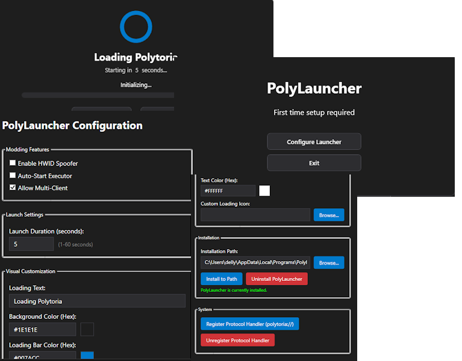

 

PolyLauncher is a clean, modern, and open-source launcher for Polytoria, built with .NET 8 and WPF. It provides a streamlined experience for installing, updating, and launching Polytoria with built-in modding support.

## Demo

## Features

- **Automated Updates**: Keeps your game up to date with the latest versions.
- **Modding Support**: Built-in services to manage and apply mods.
- **Protocol Integration**: Supports launching directly from the Polytoria website.
- **Configuration**: Highly customizable settings for your launcher experience.
- **Lightweight**: Optimized for performance and low resource usage.

## Download

Check Releases Or Github Actions

## Overview

## Project Structure

- **Models**: Data structures for settings, launch arguments, and updates.
- **ViewModels**: Implementation of the MVVM pattern for UI logic.
- **Views**: WPF windows and user interface components.
- **Services**: Core logic for installation, modding, logging, and protocols.

## Getting Started

### Prerequisites

- [.NET 8.0 Runtime](https://dotnet.microsoft.com/download/dotnet/8.0) or SDK.

### Running Locally

1. Clone the repository: `git clone https://github.com/Polytoria/PolyLauncher.git`
2. Open `PolyLauncher.sln` in Visual Studio or your preferred IDE.
3. Restore dependencies: `dotnet restore`
4. Build and run: `dotnet run --project PolyLauncher.csproj`

## License

This project is licensed under the [LICENSE](LICENSE) file included in the repository.

